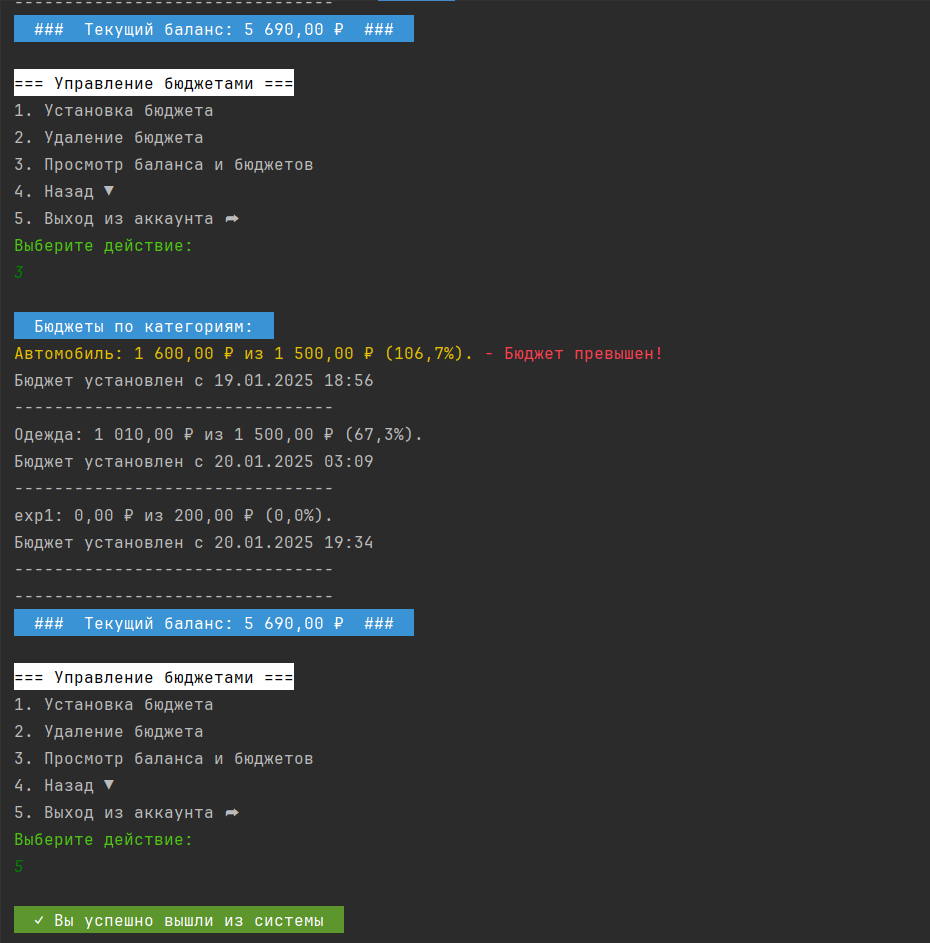

#### Ковалёв Евгений. 
#### Учебный проект по курсу "Принципы ООП". МИФИ, магистратура ИИКС, 1 курс

-------------

# Итоговый проект «Система управления личными финансами»

**MiCartera - консольное Java-приложение для управления личными финансами, которое позволяет пользователям контролировать свои доходы и расходы, устанавливать бюджеты по категориям и отслеживать финансовые операции.**

Приложение не использует БД для хранения информации о пользователях и их кошельках. Вся информация сохраняется в виде json-файлов в `./storage/users/<userId>.json` для данных пользователя и `./storage/users/<userId>_wallet.json` для всех данных о кошельке пользователя.

## Архитектура
Проект построен на основе многоуровневой архитектуры:
- Presentation Layer (CLI): обработка пользовательского ввода и отображение данных
- Application Layer: реализация бизнес-логики и валидации
- Domain Layer: бизнес-модели и правила
- Infrastructure Layer: сервисы для работы с файловой системой

## Файловая структура проекта

```text
.
│   .gitignore
│   pom.xml
│   README.md
│
├───src
│   ├───main
│   │   ├───java
│   │   │   └───dev
│   │   │       └───micartera
│   │   │           │   Main.java
│   │   │           │
│   │   │           ├───domain
│   │   │           │   ├───exception
│   │   │           │   │       AuthenticationException.java
│   │   │           │   │       CommandCancelledException.java
│   │   │           │   │       ValidationException.java
│   │   │           │   │
│   │   │           │   ├───model
│   │   │           │   │       Budget.java
│   │   │           │   │       Category.java
│   │   │           │   │       Transaction.java
│   │   │           │   │       TransferFile.java
│   │   │           │   │       User.java
│   │   │           │   │       Wallet.java
│   │   │           │   │
│   │   │           │   └───service
│   │   │           │           AuthenticationService.java
│   │   │           │           NotificationService.java
│   │   │           │           TransactionService.java
│   │   │           │           ValidationService.java
│   │   │           │           WalletService.java
│   │   │           │
│   │   │           ├───infrastructure
│   │   │           │   ├───config
│   │   │           │   │       ApplicationConfig.java
│   │   │           │   │       LoggerConfig.java
│   │   │           │   │
│   │   │           │   ├───repository
│   │   │           │   │   │   TransactionRepository.java
│   │   │           │   │   │   UserRepository.java
│   │   │           │   │   │   WalletRepository.java
│   │   │           │   │   │
│   │   │           │   │   └───impl
│   │   │           │   │           TransactionRepositoryImpl.java
│   │   │           │   │           UserRepositoryImpl.java
│   │   │           │   │           WalletRepositoryImpl.java
│   │   │           │   │
│   │   │           │   └───util
│   │   │           │           JsonUtils.java
│   │   │           │
│   │   │           └───presentation
│   │   │               ├───cli
│   │   │               │       ConsoleUI.java
│   │   │               │
│   │   │               ├───menu
│   │   │               │       MenuManager.java
│   │   │               │
│   │   │               ├───service
│   │   │               │       SessionState.java
│   │   │               │
│   │   │               └───util
│   │   │                       Color.java
│   │   │                       ColorPrinter.java
│   │   │
│   │   └───resources
│   │       └───logback.xml
│   │       
│   │       
│   │       
│   │
│   └───test
│       └───java
└───storage
    ├───config
    │       application.properties
    │
    ├───logs
    ├───transfers
    ├───users
    │       2d802ce7-ec8e-458c-a87c-9ec7450eb07e.json
    │
    └───wallets
            2d802ce7-ec8e-458c-a87c-9ec7450eb07e_wallet.json

```

## Базовый функционал
1. Хранение данных
    - Реализовано хранение всех данных в JSON-файлах
    - Структурированное хранение в папках по типам данных

2. Авторизация пользователей
    - Регистрация новых пользователей
    - Вход по логину и паролю
    - Поддержка многопользовательского режима

3. Управление финансами
    - Добавление доходов и расходов
    - Создание и удаление категорий
    - Установка бюджетов по категориям

4. Работа с кошельком
    - Привязка кошелька к пользователю
    - Хранение истории операций
    - Управление бюджетами по категориям

5. Вывод информации
    - Отображение баланса
    - Просмотр операций по периодам
    - Детализация по категориям
    - Информация о текущих бюджетах

6. Подсчет операций
    - Общая статистика доходов/расходов
    - Анализ по категориям
    - Отчеты за различные периоды

7. Валидация данных
    - Проверка корректности вводимых сумм
    - Валидация логина и пароля
    - Проверка существования категорий

8. Оповещения
    - Уведомления о превышении бюджета
    - Информирование об успешных операциях

9. Сохранение данных
    - Автоматическое сохранение при выходе
    - Загрузка данных при входе

10. Интерфейс
    - Многоуровневое меню
    - Удобная навигация

### Дополнительный функционал
- Цветовое оформление
- Настраиваемое отображение баланса
- Настройка включения/отключения уведомлений
- Оповещения о низком балансе
- Форматирование вывода денежных сумм
- Система логирования операций
- Смена пароля пользователем
- Защита данных с использованием хеширования паролей

## Как пользоваться приложением

### Клонирование репозитория

Для начала работы с приложением клонируйте репозиторий и перейдите в папку с проектом:

```bash
git clone https://github.com/eugenekweb/java-HomeBuch.git
```

### Сборка проекта

Проект использует Maven для сборки. Убедитесь, что у вас установлен Maven, затем выполните следующую команду:

```bash
mvn clean install
```

### Зависимости

Добавьте необходимые зависимости в файл pom.xml.

```xml
<dependency>
    <groupId>org.projectlombok</groupId>
    <artifactId>lombok</artifactId>
    <version>1.18.30</version>
</dependency>

<dependency>
<groupId>com.fasterxml.jackson.core</groupId>
<artifactId>jackson-databind</artifactId>
<version>2.17.2</version>
</dependency>

<dependency>
<groupId>com.fasterxml.jackson.datatype</groupId>
<artifactId>jackson-datatype-jsr310</artifactId>
<version>2.15.2</version>
</dependency>

<dependency>
<groupId>org.mindrot</groupId>
<artifactId>jbcrypt</artifactId>
<version>0.4</version>
</dependency>

<dependency>
<groupId>org.slf4j</groupId>
<artifactId>slf4j-api</artifactId>
<version>2.0.16</version>
</dependency>

<dependency>
<groupId>ch.qos.logback</groupId>
<artifactId>logback-classic</artifactId>
<version>1.5.16</version>
</dependency>
```

### Настройка конфигурации приложения

Для настройки параметров работы приложения и указания значений по умолчанию используется файл `application.properties`:

```properties
# Default path to storage
app.storage.path=./storage

# Default settings for Date & report period
app.date-format=yyyy-MM-dd HH:mm:ss
app.default-period.months=1

...
```

В файле в виде комментариев даны пояснения, для чего нужен тот или иной раздел параметров.
Из названия переменной понятно, за что она отвечает. 

## Примеры использования

### Сценарий 1: Первое использование
1. Запустить приложение
2. Выбрать пункт "Регистрация"
3. Ввести логин и пароль
4. После входа создать категории доходов/расходов
5. Установить бюджеты по категориям

### Сценарий 2: Учет ежедневных расходов
1. Войти в систему
2. Выбрать "Добавить расход"
3. Выбрать категорию
4. Ввести сумму и описание
5. Просмотреть обновленный баланс

### Сценарий 3: Анализ расходов
1. Войти в систему
2. Перейти в раздел "Отчеты"
3. Выбрать период
4. Просмотреть статистику по категориям
5. Проверить соблюдение бюджетов

## Пройдем для примера по Сценарию 1

#### Меню входа

При первом запуске приложения откроется **Главное меню** входа:

```
=== Главное меню ===
1. Вход в систему ▼
2. Регистрация ▼
3. Выход из приложения ☒
Выберите действие: 
2

=== Регистрация ===
1. Зарегистрироваться
2. Назад ▼
Выберите действие: 
1
Придумайте логин: user
Придумайте пароль: 
```

#### После ввода пароля откроется меню авторизации

Вводим логин и пароль из предыдущего шага

```
  ✓ Регистрация успешна! Теперь вы можете войти в систему.  

=== Авторизация ===
1. Войти
2. Назад ▼
Выберите действие: 
1
Введите логин: user
Введите пароль:  
```

#### После авторизации мы попадаем в главное меню пользователя:

```
  ✓ Добро пожаловать, user!  
--------------------------------
  ###  Текущий баланс: 0,00 ₽  ###  

=== Главное меню ===
1. Управление финансами ▼
2. Переводы ▼
3. Статистика и отчеты ▼
4. Настройки ▼
5. Выход из аккаунта ➦
6. Выход из приложения ☒
Выберите действие:   
```

#### Идем в меню Управление финансами

```
--------------------------------
  ###  Текущий баланс: 0,00 ₽  ###  

=== Управление финансами ===
1. Добавить расход
2. Добавить доход
3. Управление категориями ▼
4. Просмотр баланса и бюджетов
5. Назад ▼
6. Выход из аккаунта ➦
Выберите действие:    
```

И можем сразу вызвать пункт `2` `Добавить доход`, приложение увидит, что у нас еще нет категорий и предложит создать.
Укажем новую категорию дохода и сумму "пополнения" баланса. Можно оставить комментарий к категории, это опционально.

#### "Пополним" наш кошелек

```
Выберите действие: 
2
Введите сумму дохода: 100000

У вас пока нет категорий типа 'ДОХОДЫ'
Создать новую категорию? (да/нет)
да
Введите название категории: Накопления
Введите описание (опционально): текущие сбережения

  ✓ Доход успешно добавлен  
--------------------------------
  ###  Текущий баланс: 100 000,00 ₽  ###  

  Уведомления:  
  ! Доход: 100000,00 (Накопления)  

=== Управление финансами ===
1. Добавить расход
2. Добавить доход
3. Управление категориями ▼
4. Просмотр баланса и бюджетов
5. Назад ▼
6. Выход из аккаунта ➦
Выберите действие:     
```

Теперь можем добваить статью расходов, жмем `1` `Добавить расход`, приложение увидит, что у нас еще нет расходных категорий и предложит создать новую. А затем предложит ввести сумму расхода и комментарий к статье расходов.


#### Добавляем расходную категорию

```
Выберите действие: 
1
Введите сумму расхода: 350

У вас пока нет категорий типа 'РАСХОДЫ'
Создать новую категорию? (да/нет)
да
Введите название категории: Питание
Введите описание (опционально): завтраки и бизнес-ланчи на работе

  ✓ Расход успешно добавлен  
--------------------------------
  ###  Текущий баланс: 99 650,00 ₽  ###  

  Уведомления:  
  ! Расход: 350,00 (Питание)  

=== Управление финансами ===
1. Добавить расход
2. Добавить доход
3. Управление категориями ▼
4. Просмотр баланса и бюджетов
5. Назад ▼
6. Выход из аккаунта ➦
Выберите действие: 

```
Нам добавилась новая расходная категория. По ней прошла транзакция на указанную сумму. Баланс пересчитался.

Однако, мы рассчитываем, что не будем тратить на обеды на работе в месяц более 4000р.

#### Установим на категорию лимит - бюджет 

Идем в "Управление категориями" -> Управление бюджетами 

```
Выберите действие: 
3
--------------------------------
  ###  Текущий баланс: 99 650,00 ₽  ###  

=== Управление категориями ===
1. Просмотр категорий
2. Создание категории
3. Удаление категории
4. Управление бюджетами ▼
5. Назад ▼
6. Выход из аккаунта ➦
Выберите действие: 
4
--------------------------------
  ###  Текущий баланс: 99 650,00 ₽  ###  

=== Управление бюджетами ===
1. Установка бюджета
2. Удаление бюджета
3. Просмотр баланса и бюджетов
4. Назад ▼
5. Выход из аккаунта ➦
Выберите действие: 
1

  Категории расходов:  
1. Питание
Выберите номер категории: 
```
У нас только одна категория расходов сейчас, поэтому вывелась только она. Выбираем вводом `1`.

#### Бюджет в 4000р на категорию "Питания" установлен  

```
Выберите действие: 
1

  Категории расходов:  
1. Питание
Выберите номер категории: 1
Введите лимит бюджета: 4000

  ✓ Бюджет успешно установлен  
--------------------------------
  ###  Текущий баланс: 99 650,00 ₽  ###  

=== Управление бюджетами ===
1. Установка бюджета
2. Удаление бюджета
3. Просмотр баланса и бюджетов
4. Назад ▼
5. Выход из аккаунта ➦
Выберите действие:  
```

#### Проверим, что там по балансу и бюджетам 

Жмем `3` `Просмотр баланса и бюджетов`

```
Выберите действие: 
3

  Бюджеты по категориям:  
Питание: 0,00 ₽ из 4 000,00 ₽ (0,0%).
Бюджет установлен с 20.01.2025 23:40
--------------------------------
--------------------------------
  ###  Текущий баланс: 99 650,00 ₽  ###  

=== Управление бюджетами ===
1. Установка бюджета
2. Удаление бюджета
3. Просмотр баланса и бюджетов
4. Назад ▼
5. Выход из аккаунта ➦
Выберите действие: 
```
Всё отлично! Бюджет установлен.

#### А что будет, если мы превысим бюджет по категории? 

Предлагаю Вам попробовать самим...

В репозитории оставлены текущий пользователь и еще 1 непустой пользователь, с которыми можно поэкспериментировать. Также, Вы можете сделать своих новых пользователей. Данные для входа по двум тестовым пользователям: логин - пароль.

```
user
111

user1
qqq
```

## Пример работы с приложением в консоли (скрин)

